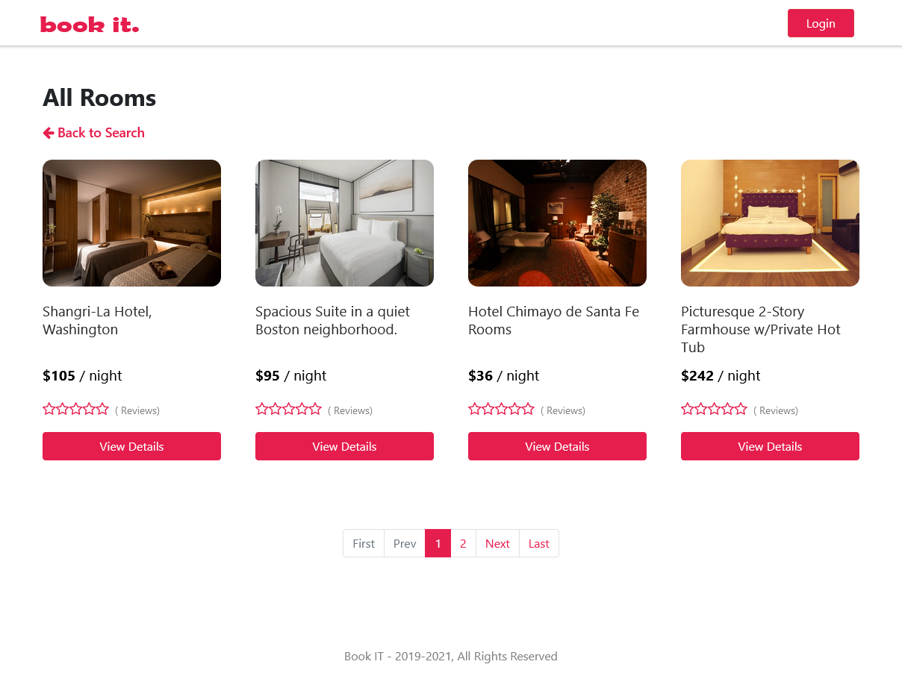

# BookIT

Next.js booking application build with node.js back-end, next-auth (Credentials Provider), stripe checkout and server-side rendered pages.

## Technologies

Project is created with:

- React
- React-Context
- Next.js
- Mongodb
- Stripe
- Cloudinary

## Setup

To run this project, install it locally using npm:

```
$ npm install
$ npm run dev
```

## Screenshots


